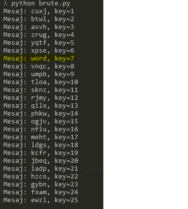

# CAESAR ENCRYPT AND BRUTE FORCE TOOL

## How to use

# 1-Encryption

* Open "encrpyt.py" file in your editor.
* Enter your text to encrypt in "kelime" variable and don't use spaces.
* Enter your key to "key" variable and key must be between 1 and 25
### NOTE: key must be integer

# 2-Brute Force

* Open "brute.py" file in your editor.
* Enter your encrypted text in "kelime" variable and don't use spaces.
* The key end unencrypted text will be shown on your terminal.

# Example of Brute Force

